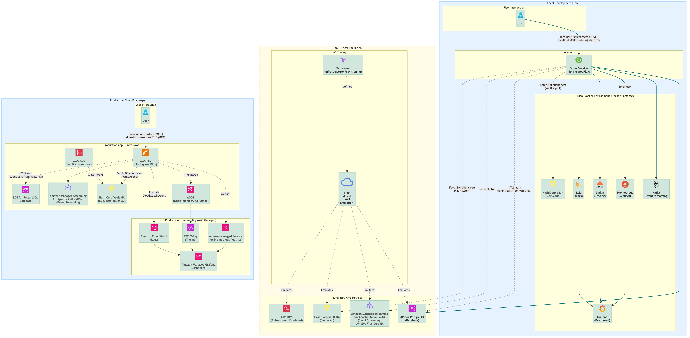
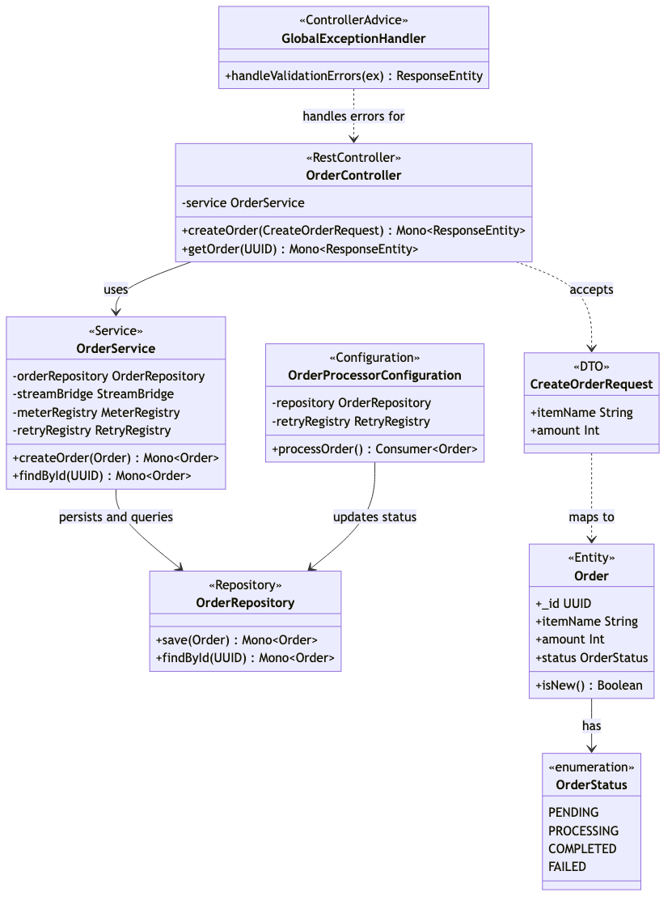
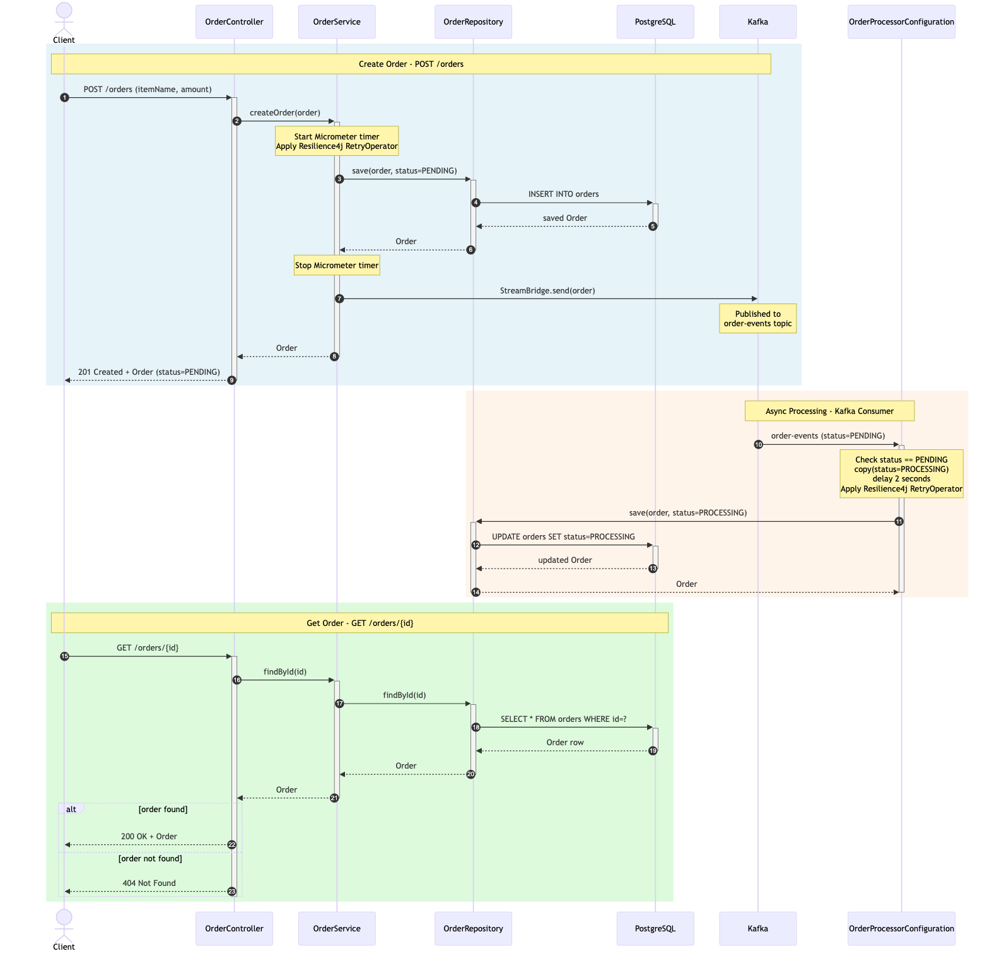

# # Reactive Order Service

A high-performance, non-blocking order management microservice built with Kotlin and Reactive Programming.

## 🚀 Tech Stack

- **Runtime:** Kotlin & JDK 21
- **Framework:** Spring Boot 3.x (WebFlux)
- **Persistence:** R2DBC with PostgreSQL
- **Messaging:** Apache Kafka (Event-driven architecture)
- **Database Migration:** Flyway
- **Build Tool:** Gradle (Kotlin DSL)
- **Testing:** JUnit 5, MockK, Kotest
- **Diagramming:** Mermaid.js

## 🏛️ Architecture

The architecture is designed to be cloud-native, with a clear separation between the local development environment and the production goal.

### Architecture Overview

High-level view of the system components across local development, IaC emulation, and the production AWS environment.

<div align="center">



</div>

### Class Diagram

Internal structure of the service: domain entities, the layered architecture (controller → service → repository), and the asynchronous Kafka consumer.

<div align="center">



</div>

### Sequence Diagram

Complete request lifecycle for creating and retrieving an order, including the synchronous HTTP flow and the asynchronous Kafka consumer processing.

<div align="center">



</div>

## 🛠 Architecture Highlights

- **Reactive Pipeline:** End-to-end non-blocking flow from the API layer to the database.
- **Event-Driven:** Asynchronous order processing and status updates via Kafka.
- **Scalability:** Designed to handle high-concurrency workloads with minimal thread blocking.
- **Diagrams as Code:** The architecture diagram is maintained as code using Mermaid.js, ensuring it stays in sync with the project's evolution.

## 💎 Quality Standards

- **Functional Style:** Leveraging Kotlin's expressive syntax and functional programming patterns.
- **Clean Code:** Adhering to SOLID principles and a clear separation of concerns.
- **Validation:** Robust request validation using Spring Boot Validation.
- **Static Analysis:** Automated code quality and security scanning with SonarCloud.

## 🗺️ Roadmap & Future Enhancements

This project serves as a strong foundation. The following features are planned for future iterations:

- **🔐 Vault HA + PKI:** Provision a highly available HashiCorp Vault cluster (single region, multi-AZ on EC2, Raft storage) via Terraform, with AWS KMS for auto-unseal. Use Vault's PKI secrets engine to establish a two-tier CA hierarchy and issue short-lived client certificates for the Order Service, enabling mTLS authentication against PostgreSQL. Locally emulated via Floci.
- **📈 Observability as Code:** Define Grafana dashboards and Prometheus alerts as code using `Terraform` to ensure the observability stack is version-controlled and repeatable.
- **🗄️ Floci MSK emulation:** Run Kafka locally through Terraform + Floci (the same code path used in production) once the upstream Floci bug is resolved — see the note below.

## 🏗️ Local Infrastructure (Terraform + Floci)

All infrastructure is defined as code using Terraform. In production every resource runs on AWS. Locally, [Floci](https://github.com/floci-io/floci) — a free, MIT-licensed AWS emulator — is used where supported; Docker Compose fills the gaps where Floci has known limitations.

### Local vs Production

| Service | Local | Production |
|:---|:---|:---|
| **VPC / Networking** | Terraform + Floci | Terraform + AWS |
| **PostgreSQL** | Terraform + Floci (`aws_db_instance`, `create_db_subnet_group = false`) | Terraform + AWS RDS |
| **Kafka** | Docker Compose (`apache/kafka`, `localhost:9092`) | Terraform + AWS MSK |

### Why Docker for Kafka locally?

Floci 1.5.22 has a known bug: when `aws_msk_cluster` is provisioned, Floci starts the backing
Redpanda container but its internal state machine never transitions the cluster from `CREATING` to
`ACTIVE`. The Terraform AWS provider polls for `ACTIVE` before completing, so the apply hangs
indefinitely and eventually times out. Until this is fixed upstream, `create_msk = false` is set
in `terraform.local.tfvars` and Kafka runs as a plain Docker container. The MSK Terraform module
(`infra/terraform/modules/msk`) is fully defined and is used in production without changes.

### Prerequisites

- [Terraform](https://developer.hashicorp.com/terraform/install) >= 1.10.0
- Docker (already required above)

> All infrastructure is managed automatically by `make dev`. See [infra/terraform/README.md](infra/terraform/README.md) for the full Terraform reference, module docs, and production deployment guide.

## 🏁 Getting Started

### 1. Prerequisites
- **Java 21** (Required for the JVM Toolchain)
- **Docker & Docker Compose**
- **Terraform >= 1.10.0** ([install](https://developer.hashicorp.com/terraform/install))
- **Node.js & npm** (For running local scripts)

### 2. Start Infrastructure and Run
A single command starts Docker Desktop (if needed), all Docker Compose services (Floci, Kafka, observability), provisions VPC/networking and PostgreSQL via Terraform + Floci, and boots the application:

```sh
make dev
```

To stop and tear down the infrastructure:

```sh
make dev-down
```

> See [scripts/dev-up.sh](scripts/dev-up.sh) for what the setup script does step by step, and [infra/terraform/README.md](infra/terraform/README.md) for the full Terraform reference.

### 3. Run the Application
When running from your IDE instead of the terminal, run `./scripts/dev-up.sh` once first (sets up the infrastructure and writes connection details to `infra/terraform/.env.floci`), then start the application normally — the `bootRun` Gradle task reads that file automatically.

## 🧪 Testing the API

The full request collection lives in `docs/http/orders.http`. Below are the equivalent `curl` commands for running them from the terminal.

### Create an Order

```sh
curl -s -X POST http://localhost:8080/orders \
  -H "Content-Type: application/json" \
  -H "Accept: application/json" \
  -d '{"itemName": "ROG Ally X", "amount": 1}' | jq
```

The response body contains the new order's `id`. Save it for the next request.

### Get an Order

Replace `<order-id>` with the `id` from the create response:

```sh
curl -s http://localhost:8080/orders/<order-id> | jq
```

> **Note:** Order processing has an intentional ~2-second delay. If you fetch the order immediately after creating it, the status may still be `PENDING`.

### Create and Fetch in One Step

This command creates an order, captures the `id` with `jq`, and immediately fetches it:

```sh
ORDER_ID=$(curl -s -X POST http://localhost:8080/orders \
  -H "Content-Type: application/json" \
  -H "Accept: application/json" \
  -d '{"itemName": "ROG Ally X", "amount": 1}' | jq -r '.id') \
&& sleep 3 \
&& curl -s http://localhost:8080/orders/$ORDER_ID | jq
```

> `jq` must be installed (`brew install jq`). Without it, drop the `| jq` suffix — the raw JSON is still returned.

## 🔬 Code Quality & Static Analysis

This project uses SonarCloud for continuous inspection of code quality and security.

### Local Analysis with SonarQube
To run a full analysis on your local machine before committing, you can use the local SonarQube instance provided in the Docker Compose setup.

**One-Time Setup:**
1. **Start Docker:** Run `docker compose up -d` and wait for the `sonarqube` container to become operational.
2. **Log in to SonarQube:** Open <http://localhost:9000>, log in with `admin`/`admin`, and change the password when prompted.
3. **Generate a User Token:** Go to **My Account > Security** and generate a new token.
4. **Create `sonar-project.local.properties`:** In the **root of the project**, create a new file named `sonar-project.local.properties`. This file is ignored by Git. Paste the following content into it, replacing `YOUR_LOCAL_SONAR_TOKEN_HERE` with the token you just generated:

   ```properties
   # Local-only SonarQube Configuration
   # This file is ignored by Git and contains your local SonarQube server URL and token.
   sonar.host.url=http://localhost:9000
   sonar.login=YOUR_LOCAL_SONAR_TOKEN_HERE
   ```

**Running a Local Scan:**
Once set up, you can run a local scan at any time with a single command from the project root:
```sh
npm run sonar:local
```
After the analysis is complete, you can view the full report at <http://localhost:9000>.

### CI/CD Integration
On every pull request, a GitHub Actions workflow automatically runs a SonarCloud scan and decorates the PR with the results, ensuring that all new code meets the defined quality gate.

## 🎣 Pre-Commit Hooks

This project uses `pre-commit` hooks to automatically run linters and formatters before each commit. This helps maintain code quality and consistency across the team.

### Setup
1. **Install `pre-commit`:**
    If you don't have `pre-commit` installed globally, you can install it via Poetry:
    ```sh
    poetry add pre-commit --group dev
    ```
2. **Install the Git hooks:**
    From the project root, run:
    ```sh
    poetry run pre-commit install
    ```
    This command sets up the Git hooks in your local repository.

### Usage
Once installed, `pre-commit` will automatically run checks before each `git commit`. If any checks fail, the commit will be aborted, and you'll see the errors in your terminal. Fix the reported issues and try committing again.

## ✍️ Code Style & Linting

This project uses **Ktlint** to enforce consistent Kotlin code style.

### IDE Integration (Recommended)
For the best developer experience, it is highly recommended to install the official **Ktlint plugin** in IntelliJ IDEA. This will provide real-time feedback and autoformatting capabilities directly in the editor.

### Command-Line Usage
You can also use the following Gradle tasks to manage code style from the command line:

- **Check for violations:** `./gradlew ktlintCheck`
- **Autoformat Code:** `./gradlew ktlintFormat`

## 📈 Diagrams as Code

This project uses Mermaid.js to maintain the architecture diagram as code. This ensures the documentation is version-controlled and easy to update.

For detailed instructions on setup and rendering, see the [**Architecture readme**](docs/architecture/README.md).

### Quick Render Command
To update the diagram after making changes to the source file (`docs/architecture/architecture.mmd`), navigate to the architecture directory and run the rendering script:

```sh
cd docs/architecture
npm run render
```

## ⌨️ Useful Commands Cheat Sheet

### Infrastructure Management

| Action | Command |
| :--- | :--- |
| Start environment and run app | `make dev` |
| Tear down environment | `make dev-down` |
| Start observability stack only | `docker compose up -d` |
| Stop observability stack | `docker compose stop` |
| Stop and remove containers | `docker compose down` |
| Full Reset (Clean volumes) | `docker compose down -v --remove-orphans` |
| View service logs | `docker compose logs -f` |
| View specific service logs | `docker compose logs -f floci` |

### Application Development
| Action | Command |
| :--- | :--- |
| Run Unit & Integration Tests | `./gradlew test` |
| Check for Code Style Violations | `./gradlew ktlintCheck` |
| Autoformat Code | `./gradlew ktlintFormat` |
| Build Executable JAR | `./gradlew build` |
| Clean Build Assets | `./gradlew clean` |

### Troubleshooting
If the application fails to connect to Kafka or Postgres on first boot:
1. Ensure containers are healthy: `docker compose ps`
2. Check for port conflicts on: `4566` (Floci API), `7001` (Floci RDS proxy), `9092` (Kafka), `8080` (app)
3. Verify the "Service Connection" labels in `docker-compose.yml`

## 🌐 Local Services & Dashboards

Once the infrastructure is up and the application is running, you can access these local services:

- **Spring Boot Application:** <http://localhost:8080>
- **Swagger UI (API Docs):** <http://localhost:8080/swagger-ui.html>
- **OpenAPI Spec (JSON):** <http://localhost:8080/v3/api-docs>
- **Spring Boot Actuator:** <http://localhost:8080/actuator>
- **Prometheus:** <http://localhost:9090>
- **Prometheus Targets:** <http://localhost:9090/targets>
- **Grafana:** <http://localhost:3000> (Login details are in `.env.example`)
- **Zipkin Tracing:** <http://localhost:9411>
- **SonarQube (Local):** <http://localhost:9000>
- **Floci (AWS emulator):** <http://localhost:4566>

### Connecting to the Local PostgreSQL Database

PostgreSQL is provisioned via Terraform + Floci (`aws_db_instance`). After `make dev`, connection details are written to `infra/terraform/.env.floci`:

```sh
source infra/terraform/.env.floci && psql -h $DB_HOST -p $DB_PORT -U $DB_USER -d orders_db
```
