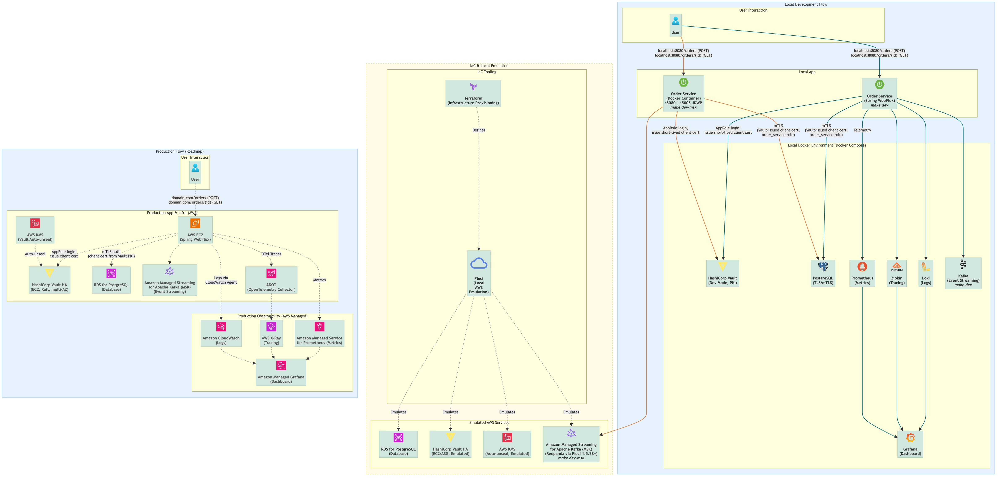
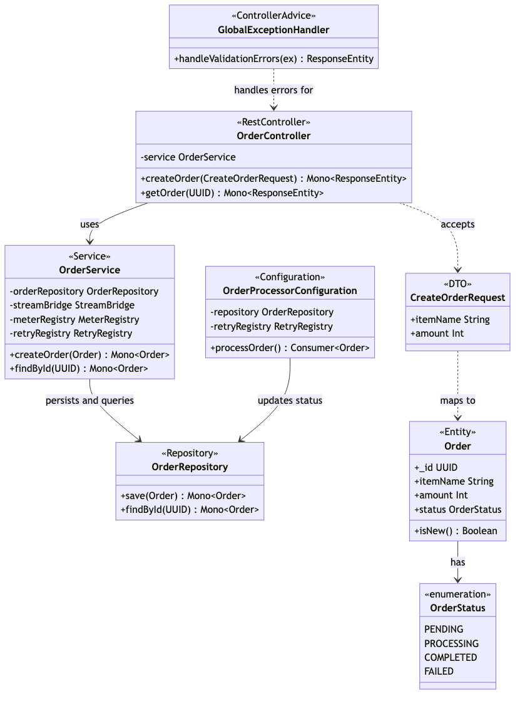
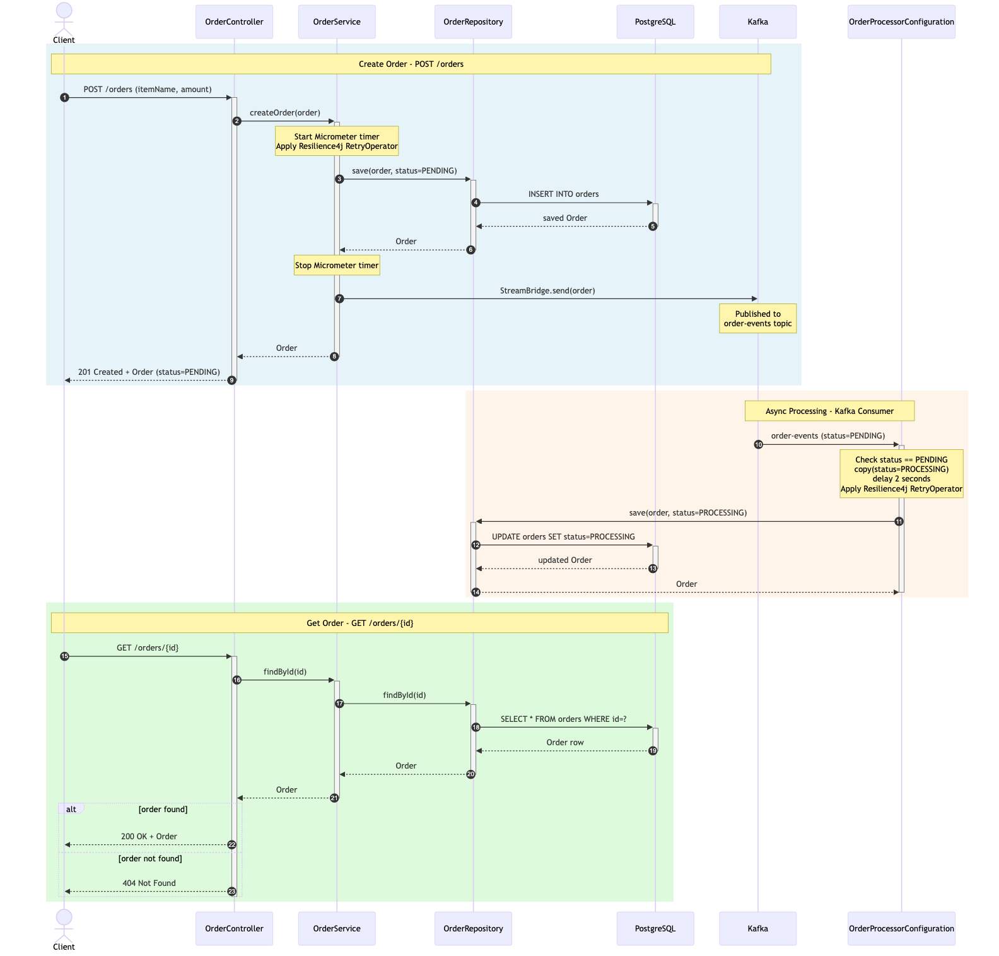

# # Reactive Order Service

A high-performance, non-blocking order management microservice built with Kotlin and Reactive Programming.

## 🚀 Tech Stack

- **Runtime:** Kotlin & JDK 21
- **Framework:** Spring Boot 3.x (WebFlux)
- **Persistence:** R2DBC with PostgreSQL
- **Messaging:** Apache Kafka (Event-driven architecture)
- **Database Migration:** Flyway
- **Build Tool:** Gradle (Kotlin DSL)
- **Testing:** JUnit 5, MockK, Kotest
- **Diagramming:** Mermaid.js

## 🏛️ Architecture

The architecture is designed to be cloud-native, with a clear separation between the local development environment and the production goal.

### Architecture Overview

High-level view of the system components across local development, IaC emulation, and the production AWS environment.

<div align="center">



</div>

### Class Diagram

Internal structure of the service: domain entities, the layered architecture (controller → service → repository), and the asynchronous Kafka consumer.

<div align="center">



</div>

### Sequence Diagram

Complete request lifecycle for creating and retrieving an order, including the synchronous HTTP flow and the asynchronous Kafka consumer processing.

<div align="center">



</div>

## 🛠 Architecture Highlights

- **Reactive Pipeline:** End-to-end non-blocking flow from the API layer to the database.
- **Event-Driven:** Asynchronous order processing and status updates via Kafka.
- **Scalability:** Designed to handle high-concurrency workloads with minimal thread blocking.
- **Diagrams as Code:** The architecture diagram is maintained as code using Mermaid.js, ensuring it stays in sync with the project's evolution.

## 💎 Quality Standards

- **Functional Style:** Leveraging Kotlin's expressive syntax and functional programming patterns.
- **Clean Code:** Adhering to SOLID principles and a clear separation of concerns.
- **Validation:** Robust request validation using Spring Boot Validation.
- **Static Analysis:** Automated code quality and security scanning with SonarCloud.

## 🗺️ Roadmap & Future Enhancements

This project serves as a strong foundation. The following features are planned for future iterations:

- **📈 Observability as Code:** Define Grafana dashboards and Prometheus alerts as code using `Terraform` to ensure the observability stack is version-controlled and repeatable.
- ~~**🗄️ Floci MSK emulation:**~~ **Done** — Kafka now runs via Terraform + Floci/Redpanda in `make dev-msk` mode. See [MSK end-to-end mode](#msk-end-to-end-mode-make-dev-msk).
- **🔐 Vault HA load balancer/DNS endpoint:** `modules/vault` currently provisions only the
  Raft ASG/EC2 nodes with no LB/DNS in front of them. Add an NLB (routing only to the active,
  unsealed leader via `sys/health?standbyok=true&activecode=200`) + Route53 record, then wire
  `vault_cluster_address` to it so production applies of `module.vault_pki` no longer need to
  pass `vault_address`/`TF_VAR_vault_address` manually.
- **🔐 Vault HA per-node TLS:** the Raft cluster's `listener "tcp"` currently has
  `tls_disable = true` (`modules/vault/templates/vault-user-data.sh.tpl`), so both client API
  traffic and inter-node Raft replication are plaintext, even within the VPC. Needs a per-node
  server certificate for each Vault instance — bootstrapped via a two-phase boot (start with TLS
  disabled, auto-unseal via KMS, then a follow-up step issues a cert and reloads the listener),
  since Vault's own PKI engine isn't reachable until Vault is already up.

## 🏗️ Local Infrastructure (Terraform + Floci)

All infrastructure is defined as code using Terraform. In production every resource runs on AWS. Locally, [Floci](https://github.com/floci-io/floci) — a free, MIT-licensed AWS emulator — is used where supported; Docker Compose fills the gaps where Floci has known limitations.

### Local vs Production

| Service | Local | Production |
|:---|:---|:---|
| **VPC / Networking** | Terraform + Floci | Terraform + AWS |
| **PostgreSQL** | Docker Compose (`postgres:16`, mTLS via Vault PKI) | Terraform + AWS RDS |
| **Kafka** | Docker Compose (`apache/kafka`, `localhost:9092`) by default; or Floci/Redpanda via `make dev-msk` (app runs as Docker sibling — see [MSK end-to-end mode](#msk-end-to-end-mode-make-dev-msk)) | Terraform + AWS MSK |
| **Vault PKI** | Docker Compose (`hashicorp/vault`, dev mode) + Terraform `vault-pki` module | Terraform `vault-pki` module against the Vault HA cluster |

> Run `make dev-iac` to additionally provision RDS via Floci/Terraform for IaC validation
> (Terraform-only — the app is not started) — see
> [Validating the RDS Terraform module](#validating-the-rds-terraform-module-make-dev-iac) below.
>
> Run `make dev-msk` to use Floci/Redpanda for Kafka instead of the plain Docker container — the
> app runs as a Docker sibling with JDWP remote debug on port 5005. See
> [MSK end-to-end mode](#msk-end-to-end-mode-make-dev-msk) below.

### Local Kafka: two modes

**Default (`make dev`):** Kafka runs as a plain `apache/kafka` Docker container on `localhost:9092`. The application runs as a native Java process on the Mac host and connects directly — simplest setup, easiest to iterate on in IntelliJ.

**MSK end-to-end (`make dev-msk`):** Kafka runs via Floci/Redpanda using the same `module.msk` Terraform module as production. This validates the full Terraform → Floci → MSK code path end-to-end.
It requires Floci 1.5.28+, which ships fixes for three bugs that previously blocked local MSK use: (a) the cluster stuck in `CREATING` state, (b) missing `BrokerSoftwareInfo` in `DescribeCluster`, and (c) Redpanda advertising the wrong broker address.

> **Why must the app run as a container in MSK mode?** Floci runs as a Docker container in this project. In that "container mode", Redpanda advertises its own Docker container hostname rather than `localhost:<port>`. That hostname resolves via Docker's embedded DNS but not from a Mac-host process.
> The application therefore runs as a Docker sibling container (`docker-compose.msk.yml` overlay) in the same Docker network. JDWP remote debugging on port 5005 is enabled to preserve IntelliJ debuggability — see [MSK end-to-end mode](#msk-end-to-end-mode-make-dev-msk).

### Why Docker for Postgres locally?

Floci's RDS emulation rejects the client's `SSLRequest` outright (it needs to read the Postgres
wire protocol in cleartext to emulate IAM/master-password auth) — it doesn't support TLS at all,
let alone mTLS. Same root cause as the MSK limitation above. `create_rds = false` is set in
`terraform.local.tfvars` and Postgres runs as a Docker container with real TLS, enabling the full
Vault PKI mTLS flow described below. The RDS Terraform module (`infra/terraform/modules/rds`) is
fully defined and is used in production without changes; run `make dev-iac` to provision it against
Floci for IaC validation — see
[Validating the RDS Terraform module](#validating-the-rds-terraform-module-make-dev-iac) for the
full walkthrough, including why the app isn't started in that mode.

### Prerequisites

- [Terraform](https://developer.hashicorp.com/terraform/install) >= 1.10.0
- Docker (already required above)

> All infrastructure is managed automatically by `make dev`. See [infra/terraform/README.md](infra/terraform/README.md) for the full Terraform reference, module docs, and production deployment guide.

## 🏁 Getting Started

### 1. Prerequisites
- **Java 21** (Required for the JVM Toolchain)
- **Docker & Docker Compose**
- **Terraform >= 1.10.0** ([install](https://developer.hashicorp.com/terraform/install))
- **Node.js & npm** (For running local scripts)

### 2. Configure `.env`

Copy the example file and fill in your values:

```sh
cp .env.example .env
```

Open `.env` and set `ALERT_EMAIL` to the address that should receive Grafana alerts:

```sh
ALERT_EMAIL=you@example.com
```

> `ALERT_EMAIL` is read by `dev-up.sh` and passed to Terraform as `TF_VAR_alert_email` to
> provision the Grafana contact point. It is never committed to source control.

### 3. Start Infrastructure and Run

**Default mode** — Kafka as a Docker container, app as a native Java process:

```sh
make dev
```

**MSK end-to-end mode** — Kafka via Floci/Redpanda (same Terraform module as production), app as a Docker sibling container with remote debug on port 5005:

```sh
make dev-msk
```

To stop and tear down the infrastructure (works for both modes):

```sh
make dev-down
```

> See [scripts/dev-up.sh](scripts/dev-up.sh) for what the setup script does step by step, and [infra/terraform/README.md](infra/terraform/README.md) for the full Terraform reference.

### 4. Run the Application
**Default mode (IntelliJ):** run `./scripts/dev-up.sh` once first (sets up infrastructure and writes connection details to `infra/terraform/.env.floci`), then start the application normally from IntelliJ — the `bootRun` Gradle task loads that file automatically.

**MSK end-to-end mode (IntelliJ):** run `CREATE_MSK=true ./scripts/dev-up.sh` to provision MSK and start the app container, then attach the IntelliJ remote debugger at `localhost:5005` — see [MSK end-to-end mode](#msk-end-to-end-mode-make-dev-msk) for the full walkthrough.

## 🧪 Testing the API

The full request collection lives in `docs/http/orders.http`. Below are the equivalent `curl` commands for running them from the terminal.

### Create an Order

```sh
curl -s -X POST http://localhost:8080/orders \
  -H "Content-Type: application/json" \
  -H "Accept: application/json" \
  -d '{"itemName": "ROG Ally X", "amount": 1}' | jq
```

The response body contains the new order's `id`. Save it for the next request.

### Get an Order

Replace `<order-id>` with the `id` from the create response:

```sh
curl -s http://localhost:8080/orders/<order-id> | jq
```

> **Note:** Order processing has an intentional ~2-second delay. If you fetch the order immediately after creating it, the status may still be `PENDING`.

### Create and Fetch in One Step

This command creates an order, captures the `id` with `jq`, and immediately fetches it:

```sh
ORDER_ID=$(curl -s -X POST http://localhost:8080/orders \
  -H "Content-Type: application/json" \
  -H "Accept: application/json" \
  -d '{"itemName": "ROG Ally X", "amount": 1}' | jq -r '.id') \
&& sleep 3 \
&& curl -s http://localhost:8080/orders/$ORDER_ID | jq
```

> `jq` must be installed (`brew install jq`). Without it, drop the `| jq` suffix — the raw JSON is still returned.

## 🔬 Code Quality & Static Analysis

This project uses SonarCloud for continuous inspection of code quality and security.

### Local Analysis with SonarQube
To run a full analysis on your local machine before committing, you can use the local SonarQube instance provided in the Docker Compose setup.

**One-Time Setup:**
1. **Start Docker:** Run `docker compose up -d` and wait for the `sonarqube` container to become operational.
2. **Log in to SonarQube:** Open <http://localhost:9000>, log in with `admin`/`admin`, and change the password when prompted.
3. **Generate a User Token:** Go to **My Account > Security** and generate a new token.
4. **Create `sonar-project.local.properties`:** In the **root of the project**, create a new file named `sonar-project.local.properties`. This file is ignored by Git. Paste the following content into it, replacing `YOUR_LOCAL_SONAR_TOKEN_HERE` with the token you just generated:

   ```properties
   # Local-only SonarQube Configuration
   # This file is ignored by Git and contains your local SonarQube server URL and token.
   sonar.host.url=http://localhost:9000
   sonar.login=YOUR_LOCAL_SONAR_TOKEN_HERE
   ```

**Running a Local Scan:**
Once set up, you can run a local scan at any time with a single command from the project root:
```sh
npm run sonar:local
```
After the analysis is complete, you can view the full report at <http://localhost:9000>.

### CI/CD Integration
On every pull request, a GitHub Actions workflow automatically runs a SonarCloud scan and decorates the PR with the results, ensuring that all new code meets the defined quality gate.

## 🎣 Pre-Commit Hooks

This project uses `pre-commit` hooks to automatically run linters and formatters before each commit. This helps maintain code quality and consistency across the team.

### Setup
1. **Install `pre-commit`:**
    If you don't have `pre-commit` installed globally, you can install it via Poetry:
    ```sh
    poetry add pre-commit --group dev
    ```
2. **Install the Git hooks:**
    From the project root, run:
    ```sh
    poetry run pre-commit install
    ```
    This command sets up the Git hooks in your local repository.

### Usage
Once installed, `pre-commit` will automatically run checks before each `git commit`. If any checks fail, the commit will be aborted, and you'll see the errors in your terminal. Fix the reported issues and try committing again.

## ✍️ Code Style & Linting

This project uses **Ktlint** to enforce consistent Kotlin code style.

### IDE Integration (Recommended)
For the best developer experience, it is highly recommended to install the official **Ktlint plugin** in IntelliJ IDEA. This will provide real-time feedback and autoformatting capabilities directly in the editor.

### Command-Line Usage
You can also use the following Gradle tasks to manage code style from the command line:

- **Check for violations:** `./gradlew ktlintCheck`
- **Autoformat Code:** `./gradlew ktlintFormat`

## 📈 Diagrams as Code

This project uses Mermaid.js to maintain the architecture diagram as code. This ensures the documentation is version-controlled and easy to update.

For detailed instructions on setup and rendering, see the [**Architecture readme**](docs/architecture/README.md).

### Quick Render Command
To update the diagram after making changes to the source file (`docs/architecture/architecture.mmd`), navigate to the architecture directory and run the rendering script:

```sh
cd docs/architecture
npm run render
```

## ⌨️ Useful Commands Cheat Sheet

### Infrastructure Management

| Action | Command |
| :--- | :--- |
| Start default dev environment (Kafka as Docker container, app native) | `make dev` |
| Start MSK end-to-end mode (Floci/Redpanda + app as Docker container, debug on :5005) | `make dev-msk` |
| Provision RDS via Floci for Terraform validation (app not started) | `make dev-iac` |
| Tear down environment (all modes) | `make dev-down` |
| Start observability stack only | `docker compose up -d` |
| Stop observability stack | `docker compose stop` |
| Stop and remove containers | `docker compose down` |
| Full Reset (Clean volumes) | `docker compose down -v --remove-orphans` |
| View service logs | `docker compose logs -f` |
| View specific service logs | `docker compose logs -f floci` |
| View app container logs (MSK mode) | `docker logs -f reactive-order-service` |

### Application Development
| Action | Command |
| :--- | :--- |
| Run Unit & Integration Tests | `./gradlew test` |
| Check for Code Style Violations | `./gradlew ktlintCheck` |
| Autoformat Code | `./gradlew ktlintFormat` |
| Build Executable JAR | `./gradlew build` |
| Clean Build Assets | `./gradlew clean` |

### Troubleshooting
If the application fails to connect to Kafka, Postgres, or Vault on first boot:
1. Ensure containers are healthy: `docker compose ps`
2. Check for port conflicts on: `4566` (Floci API), `7001` (Floci RDS proxy), `9092` (Kafka — default mode), `9300-9399` (Redpanda — MSK mode), `5432` (Postgres), `8200` (Vault), `8080` (app), `5005` (JDWP — MSK mode)
3. Verify the "Service Connection" labels in `docker-compose.yml`
4. For Postgres/Vault PKI/mTLS issues specifically, see
   [Troubleshooting Vault & AppRole authentication](#troubleshooting-vault--approle-authentication)
   and [Verifying the mTLS flow](#verifying-the-mtls-flow)
5. For MSK mode issues, see [MSK end-to-end mode troubleshooting](#troubleshooting-msk-mode)

## 🌐 Local Services & Dashboards

Once the infrastructure is up and the application is running, you can access these local services:

- **Spring Boot Application:** <http://localhost:8080>
- **Swagger UI (API Docs):** <http://localhost:8080/swagger-ui.html>
- **OpenAPI Spec (JSON):** <http://localhost:8080/v3/api-docs>
- **Spring Boot Actuator:** <http://localhost:8080/actuator>
- **Prometheus:** <http://localhost:9090>
- **Prometheus Targets:** <http://localhost:9090/targets>
- **Grafana:** <http://localhost:3000> (login: `admin` / `GRAFANA_ADMIN_PASSWORD` from `.env`)
- **MailHog (alert email capture):** <http://localhost:8025> (catches all Grafana alert emails locally — no real SMTP needed)
- **Zipkin Tracing:** <http://localhost:9411>
- **SonarQube (Local):** <http://localhost:9000>
- **Floci (AWS emulator):** <http://localhost:4566>
- **Vault (dev mode):** <http://localhost:8200> (root token: `root` — see [Local Postgres + Vault PKI mTLS](#-local-postgres--vault-pki-mtls))

### Connecting to the Local PostgreSQL Database

PostgreSQL runs in Docker Compose with TLS enabled. After `make dev`, connection details are
written to `infra/terraform/.env.floci`:

```sh
source infra/terraform/.env.floci && psql "host=$DB_HOST port=$DB_PORT dbname=orders_db user=$DB_USER password=$DB_PASSWORD sslmode=require"
```

This connects as `DB_USER` (password auth — the role Flyway uses for migrations). The application
itself connects as the `order_service` role, authenticated via the short-lived mTLS client
certificate issued by Vault PKI (see below) — there's no password for that role.

## 🔐 Local Postgres + Vault PKI mTLS

`make dev` runs the full mTLS flow end-to-end, locally:

1. A dev-mode Vault container (`hashicorp/vault`, in-memory, root token `root`) starts alongside
   the other Docker Compose services.
2. Terraform's `vault-pki` module (`infra/terraform/modules/vault-pki`) provisions a two-tier CA
   in that Vault — a root CA (`pki-root`) and an intermediate CA (`pki-int`) signed by it — then
   issues a TLS server certificate for Postgres (written to `.certs/`, gitignored) and creates an
   AppRole the application uses to fetch its own client certificate.
3. The Postgres container starts with that server certificate, `ssl = on`, and `pg_hba.conf`
   rules requiring TLS for every connection (`infra/postgres/`).
4. On startup, the application logs in to Vault via AppRole (credentials from
   `infra/terraform/.env.floci`) and requests a short-lived client certificate
   (CN `order-service.client`, ~24h TTL) from `pki-int`. It's written to a temp directory and used
   to open an mTLS connection to Postgres as the `order_service` role —
   `infra/postgres/pg_ident.conf` maps that certificate CN to the role. The certificate is renewed
   automatically before it expires.
5. Flyway migrations still run as `DB_USER` over a regular (encrypted, non-mTLS) TLS connection —
   only the application's runtime connection uses client-certificate auth.

**Resetting the PKI:** the dev-mode Vault loses all of its mounts (and therefore the CA) on every
container restart, so `dev-up.sh` re-provisions `module.vault_pki` on every `make dev`. For a
fully clean run (new CA, new certs), use `make dev-down && make dev`.

### Verifying the mTLS flow

After `make dev` finishes starting the application, confirm the whole chain end-to-end:

1. **Cert issuance on startup** — the app log should contain a single issuance line (not a flood
   of them — that would indicate the renewal-loop bug):

   ```text
   c.f.o.config.VaultPkiCertificateManager : Issued Vault PKI client certificate for
   'order-service.client', expires at 2026-06-15T09:38:44Z
   ```

2. **R2DBC connection is UP via mTLS:**

   ```sh
   curl -s http://localhost:8080/actuator/health | jq '.components.r2dbc'
   ```

   Expect `"status": "UP"`. If the app started at all (Flyway also requires a working Postgres
   connection), this is already strong evidence the cert/key/CA files were issued and accepted.

3. **End-to-end API check** — create and fetch an order (see
   [Testing the API](#-testing-the-api)). A successful `201`/`200` response means the app read and
   wrote through the mTLS connection as the `order_service` role.

4. **Direct proof at the database** — connect as `order_service` using the exact certificate the
   app was issued, and confirm Postgres sees it as an mTLS connection with the expected client DN:

   ```sh
   # Copy the app's Vault-issued client cert/key into the postgres container
   CERT_DIR="${TMPDIR:-/tmp/}order-service-pki"
   docker compose cp "$CERT_DIR/client.crt" postgres:/tmp/client.crt
   docker compose cp "$CERT_DIR/client.key" postgres:/tmp/client.key

   # Connect with verify-full against the full CA chain (root + intermediate) that
   # Terraform mounted into the container for server-side cert verification
   docker compose exec postgres bash -c '
     chmod 600 /tmp/client.key
     PGSSLMODE=verify-full PGSSLCERT=/tmp/client.crt PGSSLKEY=/tmp/client.key \
     PGSSLROOTCERT=/run/certs/ca-chain.pem \
     psql "host=127.0.0.1 port=5432 dbname=orders_db user=order_service" \
       -c "select current_user, current_database();" \
       -c "select usename, ssl, client_dn from pg_stat_ssl join pg_stat_activity using (pid) where usename = current_user;"
   '
   ```

   Expected output:

   ```text
    current_user  | current_database
   ---------------+-------------------
    order_service | orders_db

       usename     | ssl |        client_dn
   ----------------+-----+---------------------------
    order_service  | t   | /CN=order-service.client
   ```

   > **Note:** `PGSSLROOTCERT` above points at `/run/certs/ca-chain.pem` (root + intermediate,
   > mounted from `.certs/` for Postgres's own `ssl_ca_file`) — **not** the app's own
   > `$CERT_DIR/ca-chain.crt`. The app's `ca-chain.crt` contains only the intermediate CA (Vault's
   > `pki-int` issue response has no parent in its own chain), which Java's `TrustManager` accepts
   > as a trust anchor but `libpq`/`psql` does not (`certificate verify failed: unable to get
   > issuer certificate`). This is expected and not a sign that mTLS is misconfigured.

### Troubleshooting Vault & AppRole authentication

| Symptom | Likely cause | Fix |
| :--- | :--- | :--- |
| App fails at startup: `Timed out issuing initial Vault PKI certificate from http://localhost:8200` | The Vault container isn't up/healthy yet | `docker compose ps vault` and `docker compose logs vault`; confirm `curl -s "http://localhost:8200/v1/sys/health?standbyok=true" \| jq` shows `"initialized": true, "sealed": false` |
| AppRole login fails with `{"errors":["invalid role or secret ID"]}` | `infra/terraform/.env.floci` has a stale `VAULT_APPROLE_ROLE_ID`/`VAULT_APPROLE_SECRET_ID` — dev-mode Vault wipes **all** mounts (including the AppRole role/secret IDs) on every container restart | `make dev` — re-runs `dev-up.sh`, which re-provisions `module.vault_pki` and rewrites `.env.floci` with fresh credentials |
| `terraform apply -target=module.vault_pki` errors, e.g. `no default issuer configured`, or complains about resources that no longer exist | Terraform state references PKI mounts from a Vault instance that's since been wiped (container restarted without `terraform destroy`) | `make dev-down && make dev` for a fully clean run (new CA, new AppRole, new `.env.floci`) |
| App startup error containing `Input stream does not contain valid private key` / `algid parse error, not a sequence` | Vault issued a PKCS#1 private key, which Netty's `SslContextBuilder` can't parse (it requires PKCS#8) | Confirm the `issue` request sends `"private_key_format": "pkcs8"` (`VaultPkiClient.kt`) |
| `Renewed Vault PKI client certificate` logged repeatedly within seconds | The renewal delay was computed as ~0 | Confirm `PkiCertificate.ttl` is derived from `expiration - now` (`VaultPkiClient.kt`), not Vault's `lease_duration` — which is always `0` for PKI `issue` responses |

**Inspecting Vault directly** — the dev-mode Vault container is unsealed with a fixed root token
(`root`):

```sh
# UI: http://localhost:8200/ui  (token: root)

# CLI, via the running container
docker compose exec vault sh -c '
  export VAULT_ADDR=http://127.0.0.1:8200 VAULT_TOKEN=root
  vault secrets list                          # expect pki-root/, pki-int/, ...
  vault list pki-int/issuers                  # the intermediate CA issuer
  vault read auth/approle/role/order-service  # AppRole policy/TTLs
'
```

**Manually exercising the AppRole + issue flow** — replay the same two HTTP calls
`VaultPkiClient` makes on startup, to isolate whether a problem is in Vault/Terraform or in the
application:

```sh
source infra/terraform/.env.floci

VAULT_TOKEN=$(curl -s http://localhost:8200/v1/auth/approle/login \
  -d "{\"role_id\":\"$VAULT_APPROLE_ROLE_ID\",\"secret_id\":\"$VAULT_APPROLE_SECRET_ID\"}" \
  | jq -r '.auth.client_token')

curl -s http://localhost:8200/v1/pki-int/issue/order-service-client \
  -H "X-Vault-Token: $VAULT_TOKEN" \
  -d '{"common_name":"order-service.client","private_key_format":"pkcs8"}' \
  | jq '{expiration: .data.expiration, ca_chain_length: (.data.ca_chain | length)}'
```

A successful response has a non-empty `expiration` (epoch seconds, ~24h from now).

### Validating the RDS Terraform module (`make dev-iac`)

`make dev` always runs with `create_rds = false`, so the app gets full local mTLS connectivity via
the Docker Compose Postgres above. `make dev-iac` is a separate, **Terraform-only** path for
validating the `rds` module's `terraform plan`/`apply` against Floci — **the application is not
started** in this mode, because Floci's RDS emulation doesn't support TLS at all (see
"Why Docker for Postgres locally?" above), and Flyway's connection requires `sslmode=require`.

1. **Provision RDS via Floci:**

   ```sh
   make dev-iac
   ```

   This re-applies Terraform with `create_rds = true` and prints the Floci RDS endpoint, e.g.:

   ```text
   RDS endpoint : localhost:7001
   ```

   — distinct from `localhost:5432` (the default Docker Compose Postgres), confirming Floci
   provisioned a separate RDS instance.

2. **Inspect the Terraform state/outputs:**

   ```sh
   cd infra/terraform
   terraform output   # rds_endpoint, rds_address, rds_port, rds_database_name
   terraform show     # full resource attributes for module.rds
   cd ../..
   ```

3. **Connect directly to validate the instance** (password auth, `sslmode=disable` — Floci's RDS
   has no TLS support, so `sslmode=require`/`verify-full` fails with "server does not support
   SSL"):

   ```sh
   source .env && source infra/terraform/.env.floci
   PGPASSWORD=$DB_PASSWORD psql "host=$DB_HOST port=$DB_PORT dbname=orders_db user=$DB_USER sslmode=disable" \
     -c "select current_database(), current_user, version();"
   ```

4. **(Optional) confirm the documented app-startup failure** rather than taking it on faith:

   ```sh
   ./gradlew bootRun
   ```

   Flyway fails immediately with `org.postgresql.util.PSQLException: The server does not support
   SSL` — `DB_HOST`/`DB_PORT` in `infra/terraform/.env.floci` now point at the TLS-incapable Floci
   RDS endpoint. This is expected; press <kbd>Ctrl+C</kbd>.

5. **Return to the default dev loop** — `make dev` re-applies Terraform with `create_rds = false`,
   destroying the Floci RDS instance and rewriting `.env.floci` back to `localhost:5432`:

   ```sh
   make dev
   ```

> **MSK is not part of `make dev-iac`.** MSK end-to-end validation is a separate mode — use
> `make dev-msk` (see [MSK end-to-end mode](#msk-end-to-end-mode-make-dev-msk)). `make dev-iac` is
> intentionally RDS-only: it provisions RDS to validate the Terraform module and then stops,
> because the app cannot connect to Floci's TLS-incapable RDS endpoint.

### MSK end-to-end mode (`make dev-msk`)

`make dev-msk` validates the MSK Terraform module end-to-end against Floci — the same
`infra/terraform/modules/msk` used in production — with Redpanda as the Kafka backend. It requires
Floci 1.5.28+.

#### How it works

When `CREATE_MSK=true`, `dev-up.sh`:
1. Skips the plain `kafka` Docker Compose service.
2. Applies `module.msk` via Terraform, which provisions an MSK cluster backed by Redpanda.
3. Writes the Redpanda bootstrap address to `infra/terraform/.env.floci` as `KAFKA_BOOTSTRAP_SERVERS`.
4. Builds the application JAR (`./gradlew bootJar`) and Docker image (`Dockerfile`).
5. Starts the application as a Docker sibling container (`docker-compose.msk.yml` overlay), with
   `DB_HOST=postgres` and `VAULT_ADDR=http://vault:8200` overriding the `localhost` defaults so
   service names resolve via Docker DNS.

#### Running

```sh
make dev-msk
```

On completion the script prints the Redpanda bootstrap address, app URL (`http://localhost:8080`),
and remote debug endpoint (`localhost:5005`). To follow logs:

```sh
docker logs -f reactive-order-service
```

To tear down:

```sh
make dev-down
```

#### IntelliJ remote debug

The app runs as a Docker container in this mode, but JDWP on port 5005 lets IntelliJ attach with
the same breakpoint/step-through experience as a native process:

1. **Run > Edit Configurations > + > Remote JVM Debug**
2. **Host:** `localhost` &nbsp; **Port:** `5005`
3. Click **Debug** — IntelliJ connects to the running container.

> Hot-reload is not available in this mode; code changes require a rebuild + restart
> (`make dev-down && make dev-msk`). Use `make dev` for day-to-day feature development.

#### Verifying end-to-end

1. **Health check** — confirm both `kafka` and `r2dbc` components are UP:

   ```sh
   curl -s http://localhost:8080/actuator/health | jq '{status, kafka: .components.kafka, r2dbc: .components.r2dbc}'
   ```

2. **Create and retrieve an order** — same as in default mode
   (see [Testing the API](#-testing-the-api)):

   ```sh
   ORDER_ID=$(curl -s -X POST http://localhost:8080/orders \
     -H "Content-Type: application/json" \
     -H "Accept: application/json" \
     -d '{"itemName": "ROG Ally X", "amount": 1}' | jq -r '.id') \
   && sleep 3 \
   && curl -s http://localhost:8080/orders/$ORDER_ID | jq
   ```

   A `PROCESSING` status confirms the order was published to Redpanda, consumed by the Kafka
   consumer, and written back to Postgres — the full Terraform → Floci → MSK → app code path
   exercised end-to-end.

3. **Confirm MSK brokers in Terraform output:**

   ```sh
   terraform -chdir=infra/terraform output msk_bootstrap_brokers
   ```

#### Returning to default dev mode

```sh
make dev-down && make dev
```

`make dev` re-applies Terraform with `create_msk = false`, destroying the Floci MSK cluster and
removing `KAFKA_BOOTSTRAP_SERVERS` from `.env.floci`. The app reverts to running as a native Java
process against the plain Docker Compose Kafka on `localhost:9092`.

#### Troubleshooting MSK mode

| Symptom | Likely cause | Fix |
| :--- | :--- | :--- |
| `terraform apply` errors on `module.msk` with cluster stuck in `CREATING` | Floci image is older than 1.5.28 | Pull the pinned image: `docker compose pull floci` |
| App container exits immediately with Kafka connection errors | `KAFKA_BOOTSTRAP_SERVERS` in `.env.floci` is empty or stale | Run `terraform -chdir=infra/terraform output msk_bootstrap_brokers` to confirm the value, then `make dev-down && make dev-msk` for a clean run |
| IntelliJ debugger can't connect on port 5005 | App container not yet started or still initializing | Wait for `docker logs reactive-order-service` to show the Spring Boot startup banner, then retry |
| App container cannot resolve the Redpanda hostname | App container is not in the `reactive-order-service_default` Docker network | Confirm with `docker inspect reactive-order-service \| jq '.[0].NetworkSettings.Networks'`; if missing, `make dev-down && make dev-msk` |
| `make dev` after `make dev-msk` still uses Redpanda | `.env.floci` has a stale `KAFKA_BOOTSTRAP_SERVERS` | `make dev-down` first — it re-applies Terraform with `create_msk=false` and removes the stale key |

## Known limitations

- **TLS against Floci's RDS/MSK is not supported:** Floci's emulators need to read the wire
  protocol in cleartext and reject TLS client hellos (`SSLRequest` → "server does not support
  SSL"). For RDS this means the app cannot connect to Floci's RDS endpoint with
  `sslmode=require`/mTLS, which is why Postgres runs as a plain Docker container with real TLS and
  `make dev-iac` is Terraform-only (app not started). For MSK, Floci's Redpanda runs plaintext
  Kafka — the application connects to it without TLS, which matches the
  `client_broker = "TLS_PLAINTEXT"` setting in `module.msk` (`infra/terraform/modules/msk/main.tf`)
  and is sufficient for local end-to-end validation. Full TLS to MSK is a production concern only.
- **MSK end-to-end mode requires the app as a Docker container:** because Floci runs in Docker ("container
  mode"), Redpanda advertises its container hostname rather than `localhost`. A Mac-host Java process
  cannot resolve it — see [Local Kafka: two modes](#local-kafka-two-modes) for the full explanation.
  Use `make dev` for native-process development.
- **Production RDS client-CA trust:** the `vault-pki` Terraform module and the application's Vault
  PKI client are written generically enough to target the production Vault HA cluster
  (`vault_address`/`vault_token` vars) and a real RDS Postgres instance. Whether AWS RDS for
  PostgreSQL can be configured to trust a custom client CA for `clientcert`-based mTLS (vs. IAM
  auth) needs further research and is tracked as a follow-up before this flow is used in
  production.
